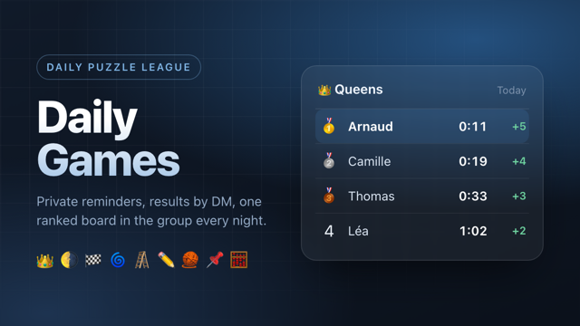

# Daily Games

A Telegram bot for a group of friends who play daily puzzle games. It reminds
each player privately, collects their results, and posts one ranked leaderboard
to the group every night.



The two problems it solves are equal: **forgetting to play**, and **scores
having no home**. Before it, the group played whatever they remembered and
pasted share text into a chat, where it scrolled away untallied.

Runs entirely on the Cloudflare free tier — one Worker holds the bot webhook,
the cron, the API and the Mini App.

---

## How it works

1. **Sign up** — tap the link the bot posts when it joins your group. That one
   tap starts the DM, selects every game, sets a 09:00 reminder and adds you to
   that group's leaderboard.
2. **Play** — the bot DMs you at your chosen hour with links to your games.
3. **Paste your results** — in the DM, or straight into the group. Either
   works, and one message can hold a whole day's games.
4. **Read the board** — posted to the group once everyone has submitted, or at
   21:00 Paris, whichever comes first. Tap through to the Mini App for
   today / this week / all time.

### iPhone: submit from the share sheet

Copying eight share texts into Telegram every day is the chore this removes.
Send `/shortcut` to the bot: it replies with a link to a signed Shortcut and a
personal URL. Install the Shortcut, paste the URL when asked, and from then on
every game is **Share → Share via → Daily Games**. The result is logged over
HTTP, acknowledged in a notification and mirrored in your DM.

The URL is the credential. `/shortcut` again rotates it and kills the old one.
The Shortcut itself is built from a plist and signed with the macOS `shortcuts`
CLI (`shortcuts sign --mode anyone`); it lives in `web/public/`.

### Games

| Game | Offerable | Id | Link |
|---|---|---|---|
| 👑 Queens | yes | `queens` | https://lnkd.in/queens |
| 🌗 Tango | yes | `tango` | https://lnkd.in/tango |
| 🏁 Zip | yes | `zip` | https://lnkd.in/zip |
| 🌀 Wend | yes | `wend` | https://lnkd.in/wend |
| 🪜 Crossclimb | yes | `crossclimb` | https://lnkd.in/crossclimb |
| ✏️ Mini Sudoku | yes | `minisudoku` | https://lnkd.in/minisudoku |
| 🧶 Patches | yes | `patches` | https://lnkd.in/patches |
| 📌 Pinpoint | yes | `pinpoint` | https://lnkd.in/pinpoint |
| 🟩 Wordle | yes | `wordle` | https://www.nytimes.com/games/wordle/ |
| 🇫🇷 Le Mot | yes | `lemot` | https://wordle.louan.me/ |
| 🧇 Waffle | yes | `waffle` | https://wafflegame.net/ |
| 🧮 Fermi | yes | `fermi` | https://fermi.gg/ |
| 🌍 Geozee | yes | `geozee` | https://geozee.earth/ |
| 📗 Table des Savoirs · Abordable | yes | `lts_abordable` | https://latabledessavoirs.fr/abordable |
| 📕 Table des Savoirs · Expert | yes | `lts_expert` | https://latabledessavoirs.fr/difficile |

Every parser is verified against real pasted share text, kept verbatim in
`test/unit/real-samples.test.ts`. If a case there fails, the parser is wrong,
not the fixture. Adding a game is a code change on purpose: a game with no
working parser would let people submit all week and score nothing.

---

## Scoring

**Step 1 — every game becomes one number, where lower is better.**

| Game | Raw | Stored |
|---|---|---|
| Queens, Zip, Tango… | `0:11` | `11` (seconds) |
| Pinpoint | `2 guesses` | `2`, or `6` when no guess lands |
| Fermi | `1.72×` | `1.72` (1.00 is perfect) |
| Table des Savoirs, Geozee | `240 points`, `257/742` | `-240`, `-257` (negated — more is better) |
| Wordle, Le Mot | `X/6` | `7` (sorts below every success) |

These numbers never reach a leaderboard. They exist only to sort one game, on
one day, within one group — which is why Fermi and Queens coexist without
comparing multipliers to seconds.

**Step 2 — rank each game each day, then convert rank to points.**

```
field size: 5
  rank 1  Alice   0:11  +5
  rank 2  Bob     0:19  +4
  rank 2  Chloe   0:19  +4      tie shares the better rank
  rank 4  Thomas  0:33  +2      and the next rank skips
  absent: Lea                   listed, scores nothing
```

`points = field − rank + 1`, where **field is everyone who *selected* that
game** — played or not. That is the load-bearing choice. It means a day when
one person shows up is worth exactly as much as a busy one:

```
quiet day, Alice alone and slower:
  rank 1  Alice   0:45  +5
```

Otherwise turning up on a quiet day would *cost* points, which is backwards for
a game about daily habit.

**Step 3 — two aggregates, because they reward different things.**

- **Total** rewards turning up. It is the headline number.
- **Average per game** rewards being good, and needs a floor or one lucky first
  place is unbeatable: you must have played **60% of the days since you joined
  that group** to appear.

The denominator is *since you joined*, not the whole period, so a newcomer is
not punished for days they could not have played.

Standings are a property of the group, not the player. One score feeds every
group you are in, ranked against a different field each time.

---

## Setup

```bash
pnpm install
pnpm exec wrangler login   # interactive, opens a browser
pnpm bootstrap             # everything else
```

`pnpm bootstrap` is safe to re-run. It checks your Cloudflare login, validates
the bot token against `getMe`, creates the D1 database and writes its id into
`wrangler.jsonc`, applies the schema, generates and stores `WEBHOOK_SECRET`,
builds the Mini App, deploys, and registers the webhook with `allowed_updates`
scoped to what the bot actually handles.

> Named `bootstrap`, not `setup`: `pnpm setup` is a built-in pnpm command that
> configures pnpm itself and edits your shell profile, and built-ins shadow
> scripts. Same reason the deploy script is invoked as `pnpm run deploy`.

Three things only BotFather can do:

1. **`/newapp`** → point at the Workers URL → copy the **short name** into
   `MINIAPP_SHORT_NAME` in `wrangler.jsonc`, then `pnpm run deploy`. Use
   `assets/miniapp-cover.png` for the required 640×360 image.
2. **`/setuserpic`** → upload `assets/bot-icon.png`.
3. **`/setprivacy` → Disable**, then **remove and re-add the bot to each
   group**. Without this the bot cannot see results pasted in the group; the
   re-add is required because the setting does not apply retroactively.

`MINIAPP_SHORT_NAME` and `BOT_USERNAME` have no defaults on purpose. An
unregistered short name produces a `t.me` link that silently resolves to
nothing, and every group invite link is built from the username — a wrong value
posts links that look right and open nothing, so the Worker refuses to start
without it.

### Doing it by hand

```bash
pnpm exec wrangler d1 create daily-games      # paste database_id into wrangler.jsonc
pnpm db:remote                                 # schema
pnpm exec wrangler secret put BOT_TOKEN
pnpm exec wrangler secret put WEBHOOK_SECRET
pnpm run deploy                                # note the workers.dev URL
curl "https://api.telegram.org/bot<TOKEN>/setWebhook" \
  -d "url=https://<worker>/telegram/webhook" \
  -d "secret_token=<WEBHOOK_SECRET>"
```

---

## Operations

All admin endpoints take `X-Admin-Secret: <WEBHOOK_SECRET>`.

| Endpoint | Why it exists |
|---|---|
| `POST /admin/run-cron` | Cron fires every 15 minutes, a painfully slow loop when something is wrong |
| `POST /admin/replay` | Re-scores logged messages a since-fixed parser can now read |
| `POST /api/ingest/<token>` | Not admin: the iPhone Shortcut posts share text here, the token minted by `/shortcut` is the auth |
| `POST /admin/offer-game?game=<id>` | `player_games` is seeded at signup, so a game added later reaches nobody who already joined |

**Calibration.** Every message that looks like a result is stored whether or not
it parsed:

```sql
SELECT text FROM messages WHERE matched_games IS NULL ORDER BY sent_at DESC;
```

Write a regex against the real samples, ship it, then `POST /admin/replay` to
recover the days it missed — `scores.raw` keeps the original message.

**Is the scheduler alive?**

```sql
SELECT source, count(*), datetime(max(ran_at),'unixepoch') FROM cron_runs GROUP BY source;
```

A tick that finds no work is otherwise indistinguishable from one that never
ran. Note that changing a cron trigger takes up to 15 minutes to propagate, so
a tick shortly after a deploy proves nothing.

**Fake players for testing:**

```bash
TEST_CHAT=-100123 SEED_FROM_USER=456 bash scripts/seed-test-players.sh
bash scripts/seed-test-players.sh --undo
```

Three players with scores shaped to exercise ties and absences. They are
inserted `active = 0`: never DM'd, never blocking the digest, but still ranked
and still counted in the field.

---

## Development

```bash
pnpm test           # unit (pure, fast) + worker (workerd + real D1)
pnpm typecheck      # Worker and Mini App
pnpm images         # regenerate the BotFather PNGs from their HTML sources
pnpm run deploy
```

```
src/
  index.ts        routing only
  api/            leaderboard (initData auth) + admin endpoints
  bot/            onboarding, groups, DM and group ingestion
  db/             one module per table group
  games/          one parser per game, plus the registry
  lib/            time, ranking, digest, initData, deep links
  cron/           reminders and digest
web/              Vite + React Mini App, Telegram theme variables only
```

`lib/time.ts`, `lib/ranking.ts`, `lib/initdata.ts` and `games/*` are pure
functions with no D1 — that is where most of the tests live.

Dev is a second BotFather bot on its own Worker rather than a tunnel, since
webhooks need a public URL:

```bash
cp .dev.vars.example .dev.vars
pnpm exec wrangler deploy --env dev
```

---

## Design notes

Decisions that are not obvious from the code.

**Everything goes through `lib/time.ts`.** Cloudflare cron is UTC-only and
France shifts between UTC+1 and UTC+2. Nothing derives a date or hour from UTC.
The day rolls over at **04:00 Paris**, so a result pasted at 00:30 counts for
the day just played.

**Parsers fail strictly.** A message that `detect()` matches but `parse()`
cannot read is dropped rather than guessed, so it stays in the calibration
corpus instead of being scored wrongly and silently.

**The share format differs by platform.** Web puts the score after a pipe on the
header line; the iOS app puts it on the next line with no pipe. Both are
covered, and the parser will not reach further down the message than that.

**Group commands.** `/board` posts the current standings on demand and
deliberately does *not* claim the day's digest, so asking at lunchtime does not
cost you the evening post. `/links` and `/status` also work in a group.
`/games`, `/time`, `/pause` and `/resume` stay DM-only: an inline keyboard
posted in a group can be tapped by anyone, and the callback handlers key on
whoever tapped — a second person would silently rewrite a shared message to
show their own selection.

**A group message is stored if it looks like anyone's result**, not only one we
can parse — an emoji grid, or the `#game1684 0/5` shape. The first Waffle score
ever posted was discarded because no Waffle parser existed yet, which is
precisely the message the corpus is for.

**Group ingestion needs privacy mode off.** People paste results into the group
out of habit, and that used to fail invisibly — the bot could not even say so,
because it never saw the message. Reading groups also sidesteps the platform's
hardest constraint: a bot cannot DM someone who has never started it, but it
can rank what they post. Such players are created **inactive**, because marking
them active would queue a reminder that fails and retries every tick forever.

**Message ids are per chat, not per user.** The same person's DM #5 and group #5
are both "message 5", so `messages` is keyed on `(chat_id, tg_message_id)`.

**Ingestion is one transaction.** The message log and the score writes go in a
single `db.batch`, so a message is never recorded as parsed without its scores
landing too.

**The digest does not wait for a scheduler in the common case.** Completion is
checked when a score is stored, so the moment the last person submits, the board
goes up. The cron only has to cover the 21:00 cutoff — the case where somebody
has *not* played. Both paths share the `digests` claim table, so they cannot
double-post. This exists because two independent schedulers proved unreliable
here: Cloudflare's Cron Triggers never fired at all, and GitHub Actions
delivered two scheduled runs in six hours.

**The scheduler is assumed to be unreliable.** GitHub Actions delivers
scheduled runs late and sometimes not at all, so nothing depends on a tick
landing in a particular hour: reminders fire at or after their hour, and a
digest missed overnight is caught up the next day. Sparse ticks cost
punctuality, not correctness.

**Reminders fire at or after their hour, never only during it.** Matching the
current hour exactly assumes a tick lands inside every single hour; miss 09:00
and everyone set to 09:00 silently gets nothing that day. The `reminders` claim
table still guarantees one per person per day, and nothing goes out after the
digest cutoff.

**A digest missed overnight is caught up.** The play date rolls over at 04:00,
so without a backward look a day whose cutoff passed with no tick would never
post at all. Each tick also considers yesterday, once, and only if somebody
actually played.

**Idempotency.** Cron delivery is at-least-once and fires four times an hour;
completion and cutoff can both fire for the same day. `reminders` and `digests`
are claim tables — claim first, send second, release the claim if the send
throws so the next tick retries.

**The webhook fails closed and answers 200.** A plain `provided !== expected`
compares `undefined` to `undefined` when the secret is unset — false — so an
unconfigured Worker would accept every request. Separately, grammY does *not*
route errors through `bot.catch` in webhook mode, so the route catches: every
write commits before a reply is attempted, and ingestion is idempotent, so a
non-2xx would only make Telegram redeliver an update with nothing left to do.

**`initData` verification excludes only `hash`.** `signature` is part of the
signed set. Excluding it made every real Mini App launch fail with `bad-hash`.

**`botInfo` is supplied, not fetched**, or grammY calls `getMe` on every single
update: a wasted subrequest against the free tier's 50, and one more way for an
update to fail.

**Ranking fields come from today's roster.** Deselecting a game retroactively
shrinks every past field for it. Fine at six people; fixing it means
snapshotting the field per day.

---

## Licence

MIT — see [LICENSE](LICENSE).
